# District 7 Issue Reporter: How To Use It

This guide walks through the main flows in the current app:

- public issue intake
- district coverage preview
- staff login and triage
- AI routing
- outside-district handling
- analytics and notification review

The screenshots below were captured from the current local build, so the exact spacing may vary a little from the hosted demo, but the workflow is the same.

## 1. Start On The Home Page

Open the site and choose whether you want to test the public resident flow or jump straight into the staff tools.

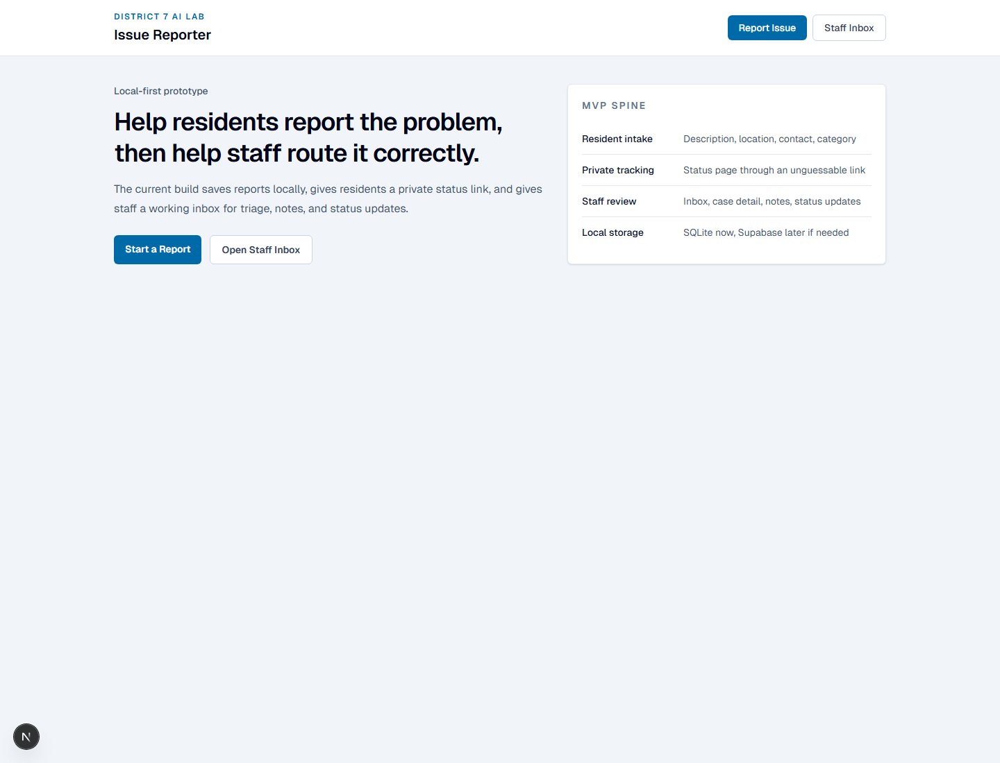

## 2. Open The Public Report Form

Click **Report Issue**. The intake form is designed to be simple and mobile-friendly.

The easiest way to demo it is to use one of the **Try an example** cards first, then edit as needed.

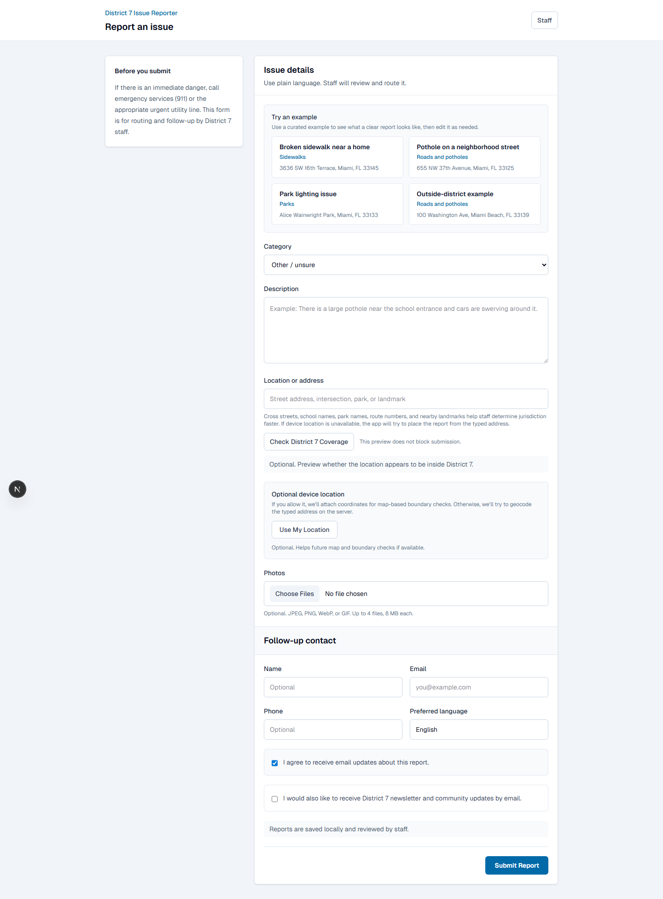

## 3. Preview District Coverage Before Submitting

After entering an address, click **Check District 7 Coverage**.

This helps answer:

- does the location look like it is in Miami-Dade County District 7?
- what municipality is it in?
- if it is outside District 7, which county commission district does it likely belong to instead?

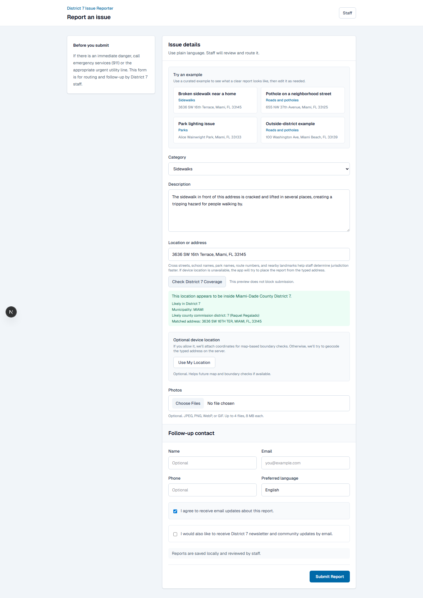

## 4. Resident Tracking Page

Each report has a private tracking page so the resident can see status updates without needing a full account.

In the local app this is reached through the report’s private tracking token.

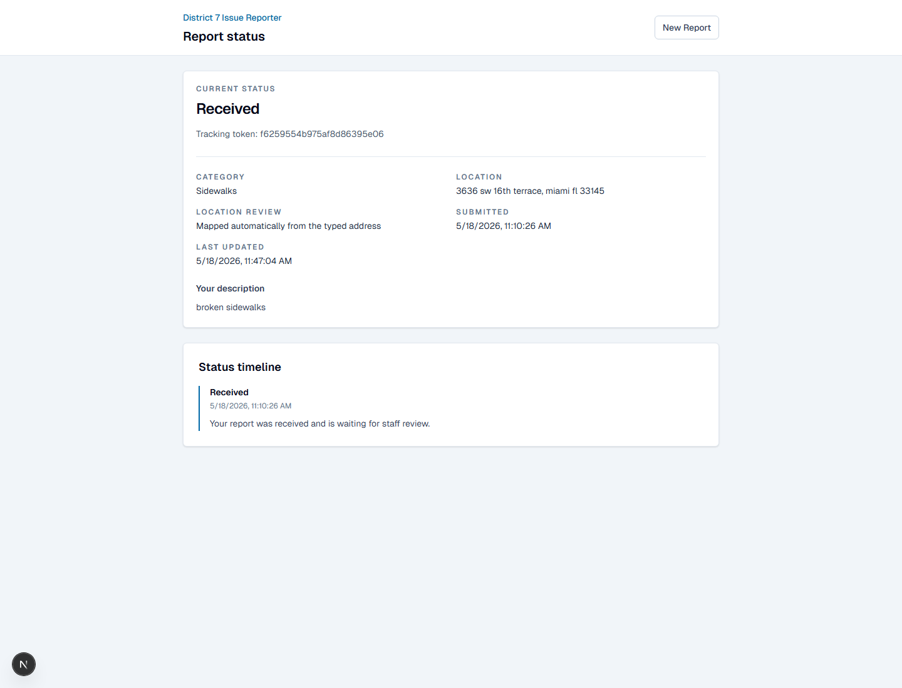

## 5. Staff Sign In

Open **Staff Inbox** and sign in.

For the hosted demo, use the demo password that was configured for the site.

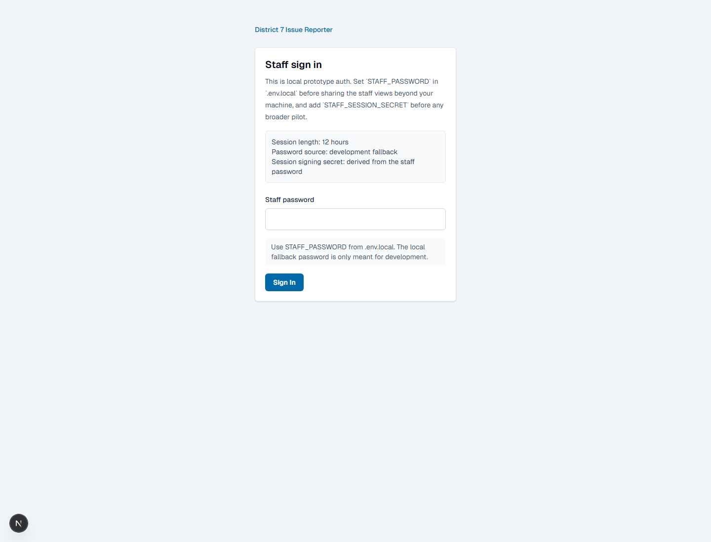

## 6. Review The Staff Inbox

The inbox is the operational starting point.

Staff can quickly scan:

- category
- description
- likely owner
- district / jurisdiction hints
- municipality
- current assignee

Use this page to decide which report to open next.

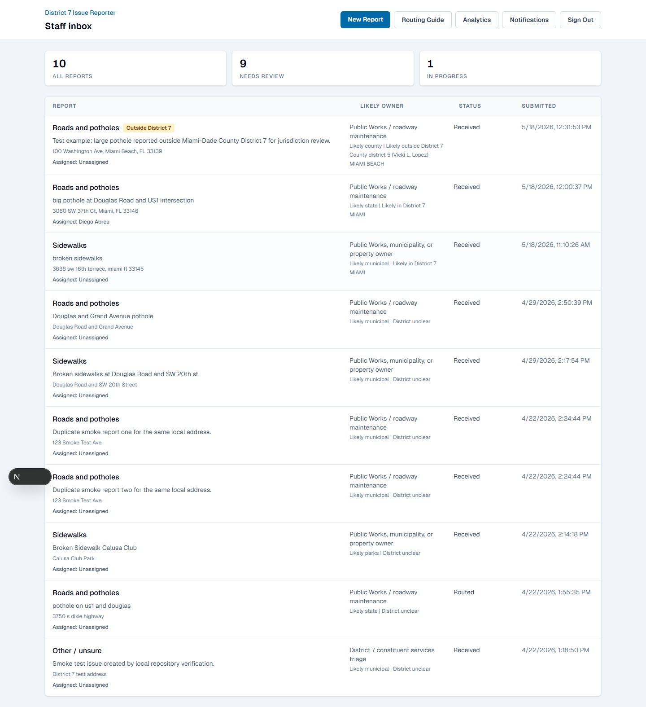

## 7. Open A Case And Review The Core Routing Context

Inside a case, the page is split into two kinds of guidance:

- **Routing suggestion**: the structured routing rule and agency context
- **Jurisdiction hints**: the location-based evidence layer

This is also where staff can see:

- geocoding result
- municipality
- county commission district
- parcel / right-of-way hints
- resident contact details
- duplicate candidates

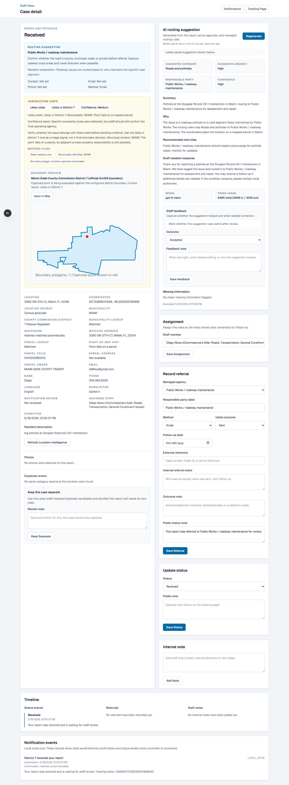

## 8. Generate The AI Routing Suggestion

In the right-hand AI panel, click **Generate**.

The AI suggestion is grounded in:

- the report description
- active agencies
- routing rules
- jurisdiction analysis
- municipality and parcel context when available

The output is meant to help staff, not replace them. It gives:

- summary
- suggested category
- urgency
- likely responsible party
- confidence
- explanation
- recommended next step
- draft resident response

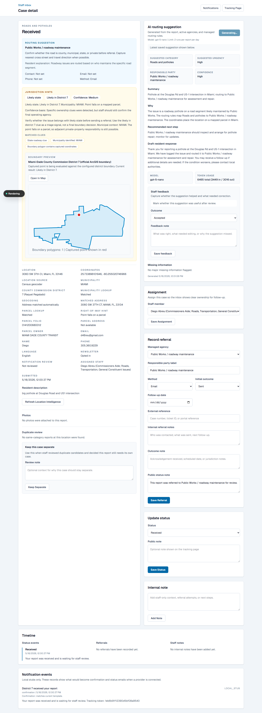

## 9. Assign The Case To A Staff Member

On the case page, use the **Assignment** section to assign ownership to a specific staff member.

This makes the inbox more actionable and helps show who is carrying the follow-up.

If a staff member’s title and focus areas are configured, those show in the dropdown.

## 10. Handle Outside-District Reports

If a location appears to be outside Miami-Dade County District 7, the case page shows a dedicated outside-district review panel.

Staff can see:

- that it is likely outside District 7
- the municipality
- the likely neighboring county commission district
- a one-click **Close As Outside Jurisdiction** action

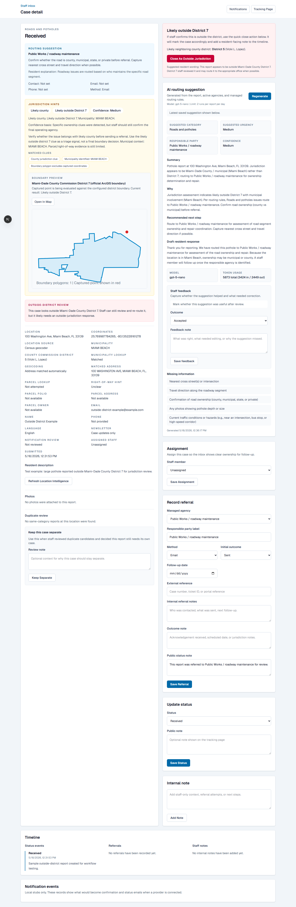

## 11. Use Analytics To Understand Patterns

The analytics page helps staff answer higher-level questions such as:

- how many reports came in this week or month?
- what categories are most common?
- how many referrals were sent?
- how is AI feedback trending?
- how many residents opted into newsletter updates?

Use the date filters at the top to switch between all-time and shorter windows.

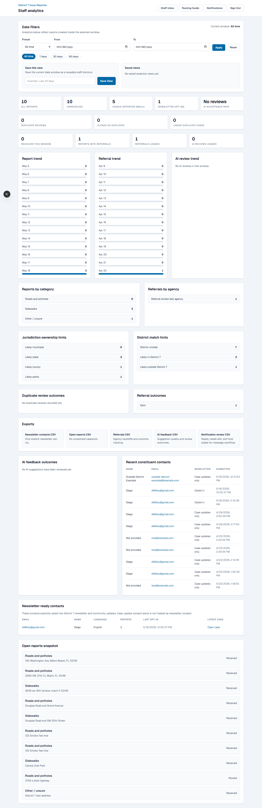

## 12. Review Notification Previews

The notification center shows what constituent messages would look like before live email is wired up.

This is useful for:

- reviewing confirmation wording
- reviewing status update wording
- checking notification review status
- editing templates before email is turned on

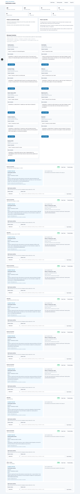

## Suggested Demo Flow

If you are showing this to someone for the first time, a good sequence is:

1. Start on the home page
2. Open the public form
3. Use a curated example
4. Run **Check District 7 Coverage**
5. Open the staff inbox
6. Open a case
7. Generate the AI routing suggestion
8. Show an outside-district example
9. End on analytics and notifications

## Short Explanation Of The Two Routing Layers

When someone asks why there is both a **Jurisdiction hints** section and an **AI routing suggestion**, the simplest explanation is:

- **Jurisdiction hints** = the grounded evidence layer
- **AI routing suggestion** = the staff recommendation layer

So:

- jurisdiction hints explain what ownership and district clues the system sees
- AI routing explains what staff should probably do next

## Current Prototype Limits

This is a strong internal prototype, but a few things are still intentionally limited:

- hosted demo submissions may not be retained
- staff auth is still lightweight
- live constituent email is not turned on yet
- AI routing is assistive, not authoritative

That said, the workflow is already strong enough to demonstrate the value of a constituent-friendly reporting and staff triage system.
